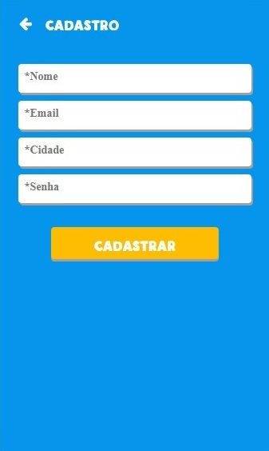
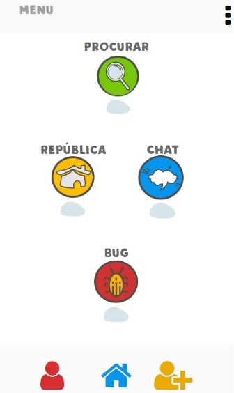
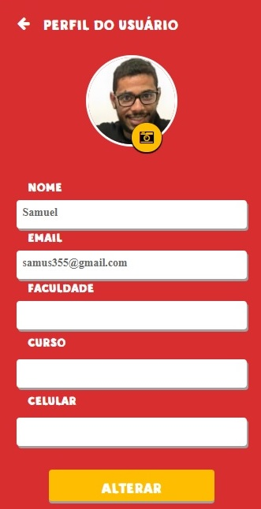
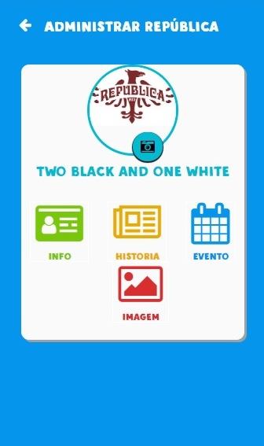
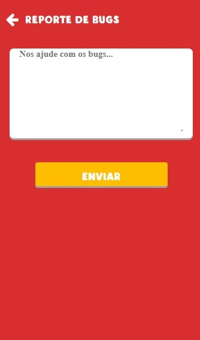
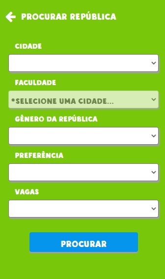
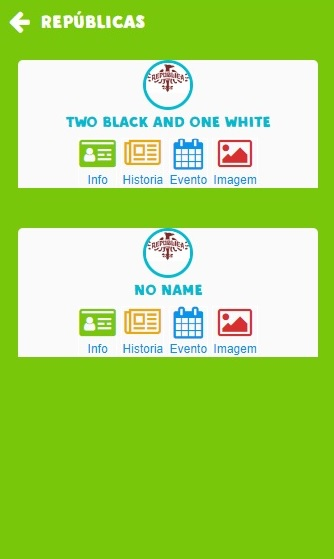
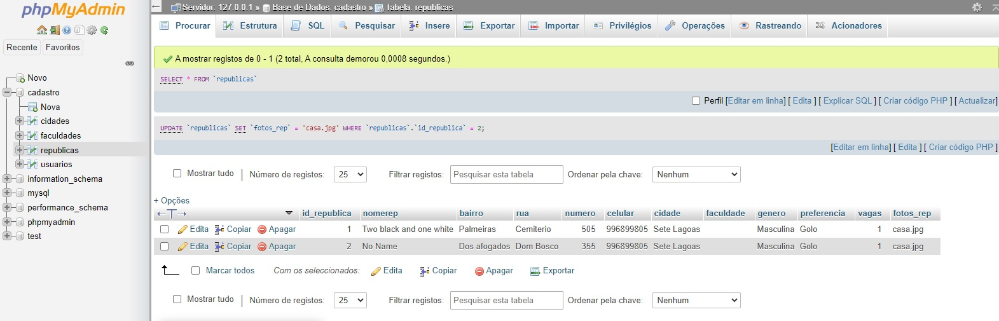

<h1 align="center">
    
</h1>

## ✦ Telas
 
<h1 align="center">
    
    
    
    
    
    
    
    
    
</h1>

## ✦ Projeto
 

O software UaiHome foi meu primeiro projeto iniciado em 2018 com o intuito de aprender mais sobre desenvolvimento de um aplicativo, portanto devido ao fato de ser um projeto de aprendizagem há varios erros e estruturas confusas. Apesar de tudo tive bastante aprendizado nesse pequeno projeto, já que executei sozinho utilizando do youtube e documentações como metodo de aprendizado.

## ✦ Tecnologias
 

Esse projeto foi desenvolvido com as seguintes tecnologias:

**Software:**
- [SQL](https://www.mysql.com/)
- [PHPMyAdmin](https://www.phpmyadmin.net/)
- [HTML5]
- [CSS]
- [JavaScript]
- [XAMPP](https://www.apachefriends.org/pt_br/index.html)

## ✦ Banco de Dados
 

Segue abaixo uma imagem da estrutura do banco de dados utilizada para que fosse possível realizar os testes no software.

<h1 align="center">
    
</h1>

---

Este projeto foi desenvolvido, para fins didáticos!
By: Samuel Silva Costa Nascimento
Graduando em Ciência da Computação na Universidade Federal de Viçosa campus Florestal
